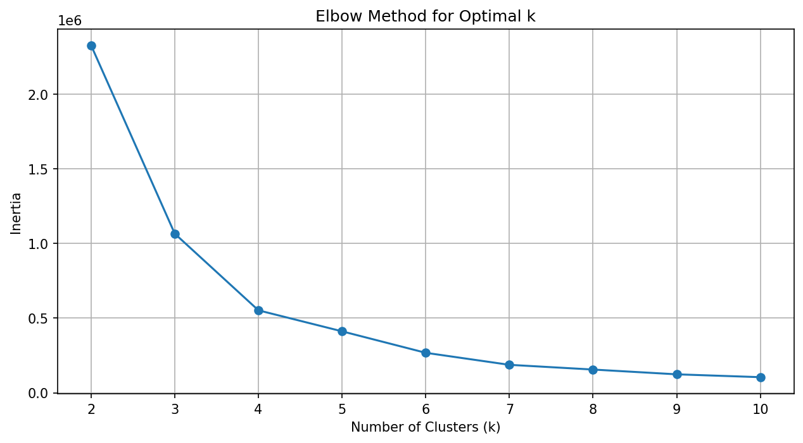

# Ottawa Airbnb Price Clustering Analysis

## Project Overview
This project analyzes Airbnb listings in Ottawa to identify distinct price clusters using data science techniques. 
The workflow covers data collection, cleaning, exploratory data analysis (EDA), clustering, and final insights. 
It aims to provide a clear picture of how Airbnb accommodations are priced across different neighborhoods in Ottawa.

---

## Data Collection
- Dataset: `DATA AIRBNB.csv` (Airbnb listings in Ottawa).
- Key variables include **price**, **latitude**, **longitude**, and other listing details.
- Data cleaning was performed to handle missing values, remove duplicates, and standardize formats.

---

## Exploratory Data Analysis (EDA)
- **Price distribution** was examined to understand the spread of Airbnb rates across Ottawa.
- **Geographical visualization**: Plotted listings on a map to see price concentration in downtown vs suburban areas.
- **Outlier detection**: Identified unusually high/low listings and treated them accordingly.
- **Descriptive statistics**: Mean, median, and variance of prices across the dataset.

**Sample Visualization:**

---

## Clustering
- **Methodology**: Applied K-Means clustering using **price, latitude, and longitude** as features.
- **Number of clusters**: Determined optimal clusters using the **elbow method** and selected **3 clusters**.
- **Clusters identified**:
  - **Cluster 0**: Low-priced accommodations (budget-friendly, wide price range $25–225, avg ~$83).
  - **Cluster 1**: Mid-priced accommodations (balanced pricing, $18–171, avg ~$86).
  - **Cluster 2**: High-priced accommodations (premium/luxury stays, $127–271, avg ~$188).

- **Visualization**: 3D plots and heatmaps showing geographic distribution of clusters.

**Sample Visualizations:**

---

## Findings & Insights
- **Cluster 2 (High Price)**: Concentrated in prime locations, likely luxury homes/apartments.
- **Cluster 1 (Mid Price)**: Represents a mix of budget and moderately priced listings with wide variability.
- **Cluster 0 (Low Price)**: Surprisingly includes some higher-priced outliers, possibly due to irregularities in listing descriptions or cleaning steps.
- **Overall trend**: Prices increase towards central/downtown Ottawa, while affordable listings are more scattered in outer neighborhoods.

---

## Tools & Libraries Used
- **Python**: Pandas, NumPy, Matplotlib, Seaborn, Folium, Scikit-learn.
- **Notebook Environment**: Jupyter Notebook.

---

## Next Steps
- Enhance dataset with more features (room type, number of reviews, availability).
- Experiment with other clustering algorithms (DBSCAN, Hierarchical Clustering).
- Build an interactive dashboard for users to explore clusters dynamically.

---

## Author
Prepared as part of a Data Analytics project to demonstrate clustering and visualization skills for recruiters and data science professionals.

